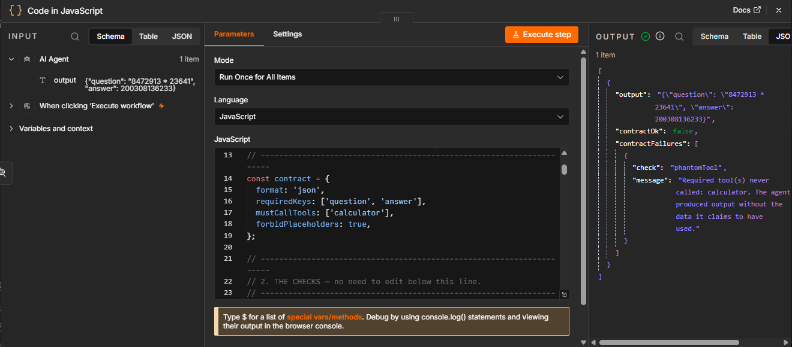

# agent-contract

**Deterministic output checks for AI agents in n8n.** No AI, no API key, no dependencies. One file you paste into a Code node.



*n8n reports the step as successful. The output is unusable. Both are true.*

---

## The problem

Years ago I helped run an automation that fed Google Form responses through Zapier into a Slack channel, so the operations team knew what to work on. For a stretch of time, nothing arrived in Slack. Zapier said every run had completed. There was no error anywhere, no alert, no failed step to investigate — we found out because a person eventually noticed the messages had stopped coming.

The automation hadn't crashed. It had succeeded at doing nothing.

AI agents fail the same way, but more often and more convincingly. n8n marks a node successful if the node's code didn't throw an exception. That's a test of *mechanical* success — did the machinery run. For a deterministic node, mechanical and useful collapse into the same thing: a broken HTTP request throws. For an LLM node they come apart completely, because a model always returns text, and text is always a valid return value.

So when your agent returns `I'm sorry, I don't have access to that information`, the node goes green. When it invents a customer's plan tier instead of looking it up, the node goes green. That output flows downstream into your CRM, your email send, your webhook — and nothing in the run history suggests anything went wrong.

## I found this on my first test run

I gave an n8n AI Agent a Calculator tool and this prompt:

> Use the calculator tool to compute 8472913 * 23641. **Do not calculate it yourself.**

The agent ignored the tool, did the arithmetic internally, and returned:

```json
{ "question": "8472913 * 23641", "answer": 200308136233 }
```

The answer is correct. The node was green. `intermediateSteps` was absent entirely — no tool was called.

My first thought was that something was broken: a misconfiguration, a bug, the agent not reading its instructions. It wasn't. The agent behaved exactly as designed. Language models decide for themselves whether a tool is worth using, and this one decided it could do the maths. **The system working normally produced a result I couldn't trust.**

That's the gap this repo fills. If it were a bug, someone would fix it. It isn't, so it needs a guard.

## What it checks

| Check | Catches |
|---|---|
| `isEmpty` | Nothing came back, or whitespace only |
| `isRefusal` | The model declined the task |
| `validJson` | Output won't parse when JSON was required |
| `requiredKeys` | Expected fields are missing |
| `phantomTool` | **Agent answered without calling its required tools** |
| `placeholderLeak` | Template scaffolding shipped as real content |
| `truncation` | Output cut off by the token ceiling |
| `promptEcho` | The agent handed your prompt back |

`phantomTool` also catches the subtler case: the tool *was* called, returned an error, and the agent answered anyway. n8n reports that as a successful execution.

## Install

There's nothing to install. Copy [`n8n-code-node.js`](n8n-code-node.js) into a **Code** node placed immediately after your AI Agent node, then edit the contract at the top:

```js
const contract = {
  format: 'json',
  requiredKeys: ['customer_name', 'priority'],
  mustCallTools: ['get_customer_record'],
  forbidPlaceholders: true,
};
```

Every item passing through gains two fields:

```json
{
  "contractOk": false,
  "contractFailures": [
    {
      "check": "phantomTool",
      "message": "Required tool(s) never called: get_customer_record."
    }
  ]
}
```

Follow it with an IF node on `{{ $json.contractOk }}`. Route the false branch to a retry, a human review queue, or an alert — anything except silently dropping the item, which trades a visible bad record for an invisible missing one.

## What it does not do

**It cannot tell you whether the answer is correct.** Ask an agent `2 + 2` and it will pass both `4` and `5`. Both are well-formed. Checking correctness requires a model that understands the task, which is a different and much harder problem.

**It doesn't read the agent's prose.** `phantomTool` doesn't parse a sentence like "I checked the customer record" to detect the claim. It compares the contract's required tools against the actual tool-call log. That catches fabrication anyway — an agent that invented a lookup didn't perform one — without needing to interpret language.

**`promptEcho` needs the original input.** If your agent output doesn't include an `input` field, that check is a no-op.

## Why not just use an LLM to check the LLM?

Because then you have two things that can be confidently wrong instead of one.

A judge model costs money on every run, adds latency, and can hallucinate its own verdict. Worse, it fails *unpredictably* — the same input can pass on Tuesday and fail on Wednesday.

Every check here is plain string and JSON logic. It runs offline, in milliseconds, at zero cost, and gives the same verdict on the same input forever. That narrowness is the product: a tool that's always right about a small question is more useful than one that's usually right about a large one, because the second kind gets deleted the first time it cries wolf.

## False positives are the real enemy

A missed failure costs you one bad record. A false positive gets the checker removed from the workflow — and a removed checker catches nothing, ever again.

So every pattern is deliberately narrow. Refusal detection requires a first-person subject, because a support ticket reading *"Cannot log in after password reset"* is a customer describing their problem, not a model refusing.

I found a real one while testing against live output. The `truncation` check flagged this as cut off:

```
847 * 236 = 847 * (200 + 30 + 6) = 169400 + 25410 + 5082 = 199892
```

Complete, correct, and ending in a digit. My rule assumed prose always ends in punctuation — but real agent output ends in numbers constantly: totals, IDs, dates, percentages. Every fixture I'd written by hand was a tidy English sentence, so nothing in my invented test set exposed it.

Live data found it on the first run. The rule now accepts digits as a clean ending, and there's still a fixture proving genuine truncation is caught.

## Tests

```
npm test
```

Runs two suites. The first checks all eight checks against 11 fixtures — nine written by hand, two captured from a live n8n agent. The second executes the *generated* Code node in a simulated sandbox to confirm it behaves identically to the tested source, so the shipped file and the tested file can't silently drift apart.

```
npm run build
```

Regenerates `n8n-code-node.js` from `check.js`. The generated file is never edited by hand.

## Status

v0.2.0. All eight checks implemented and tested. Verified end-to-end in a live n8n workflow.

Issues and pull requests welcome — particularly real agent outputs that break a check. Those are worth more than feature requests.

## License

MIT
